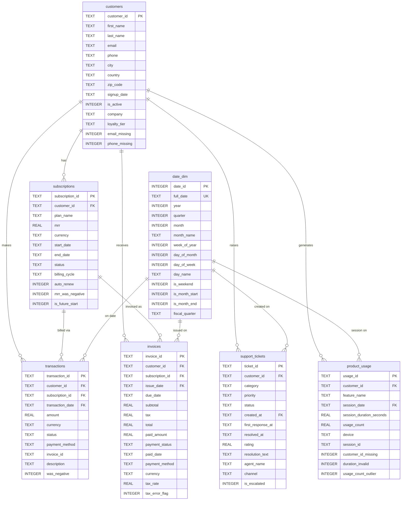

# FinOps Analytics Platform — ER Diagram
## Star Schema (with one snowflake arm)

## Schema Design Notes

### Why Star (not pure Snowflake)?
Star schema minimises JOIN depth. Most analytical queries only need
2–3 tables. A full snowflake (separate plan_dim, billing_cycle_dim,
country_dim) would add hops with no performance gain in SQLite.

### The one Snowflake arm
`subscriptions` sits between `customers` and the financial fact tables.
A customer can hold multiple subscriptions; each transaction and invoice
belongs to exactly one subscription. This models SaaS billing correctly:
the subscription is the billing unit, not the customer.

### date_dim
Avoids `strftime()` scattered across every query. Analysts join on
`full_date` and filter/group on `year`, `quarter`, `month` columns.
Covers 2021-01-01 → 2026-12-31 (2,192 rows).

### Fact table grains
| Table            | Grain                               |
|------------------|-------------------------------------|
| transactions     | One row per payment attempt         |
| invoices         | One row per billing document        |
| support_tickets  | One row per support interaction     |
| product_usage    | One row per user session event      |